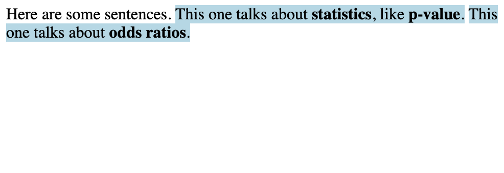

<!-- README.md is generated from README.Rmd. Please edit that file -->

```{r, include = FALSE}
knitr::opts_chunk$set(
  collapse = TRUE,
  comment = "#>",
  fig.path = "man/figures/README-",
  out.width = "100%"
)
```
# statwords

<!-- badges: start -->
<!-- badges: end -->


## Installation

You can install the development version from [GitHub](https://github.com/) with:

``` r
# install.packages("devtools")
devtools::install_github("LucyMcGowan/statwords")
```
## Example


```{r example}
library(statwords)
highlight_stat_text("Here are some sentences. This one talks about statistics, like p-value. This one talks about odds ratios.", "example.html")
```



